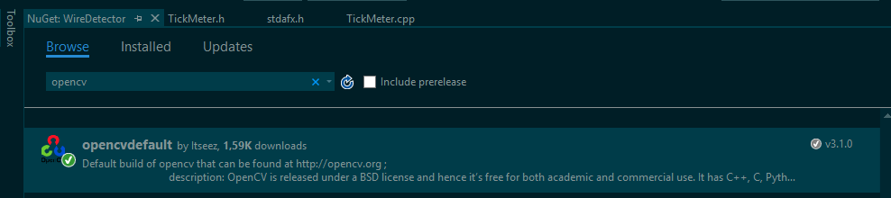
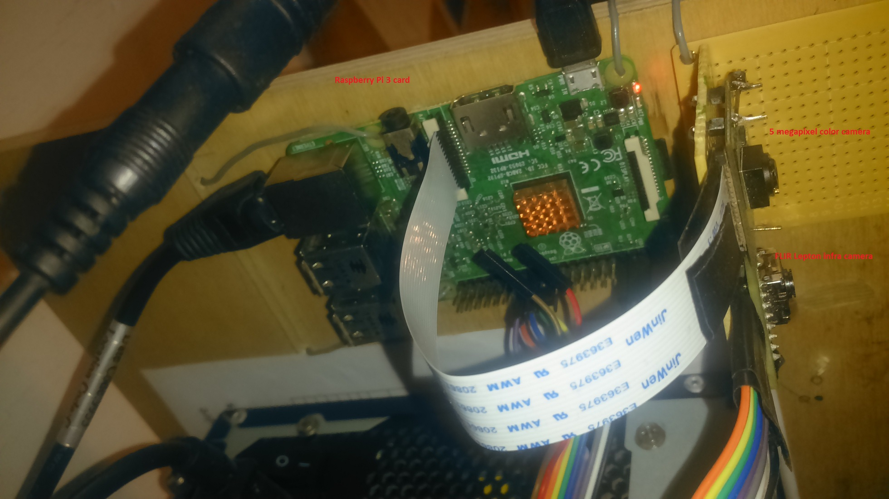

### FusionTwoCamerasFrames
Fusion (blender) are frames of color video and frames of infra video in real-time .  
Image processing to be useing OpenCV ! Version is 3.1.0. 
### Installation
Microsoft Visual Studio Community C++ 2015, Update 3. 
Open "FusionTwoCamerasFrames.sln".
### Dependencies:
Provided you already have OpenCV 3.1.0 x64 package is completely, if none, than ... 
this to be downloaded with NutGet. 
In Solution Explorer selected with mouse the "WireDetecor" project, then right click, after selected "Manage NuGet Packages...". 
Search OpenCV in online. 
Instruction, see the picture: "doc/opencv.png"  

Auto created "packages" directory in the base (root) directory: .\packages\opencvdefault.3.1.0\*
### Build
You compile the project. 
If it is ready, in the .\x64\Release\ directory created "FusionTwoCamerasFrames.exe" executed application.
### Running program.
You find *avi video files (2 pieces) in the Google Drive:
https://drive.google.com/drive/folders/0B9rmVYV9c3x8TUstbzBYN1I2MTQ?usp=sharing  
Name of video list: 
proba1Color.mp4  : 2  Mb 
proba1Ir.mp4 : 2 Mb 
You download, after them copy to .\x64\Release\ directory. 
Running is "FusionTwoCamerasFrames.exe". 
### Description
Keys: 
' ', space key: toggle command: start/stop frames of video. 
'q', quit  key: exit program. 

### Binary release files:
Google Drive: https://drive.google.com/drive/folders/0B9rmVYV9c3x8TUstbzBYN1I2MTQ?usp=sharing  
FusionTwoCamerasFrames-binary.zip 
vc_redist.x64.exe 

### Result:
From 5 mins 10 secs in the video: https://www.youtube.com/watch?v=uoD2yhA_56o&feature=share

### Source:
Dual camera system. Card is RaspBerry Pi 3 
Color camera is 5 megapixels 
Infra camera is FLIR Lepton: https://www.sparkfun.com/products/13233

Hardware picture:

